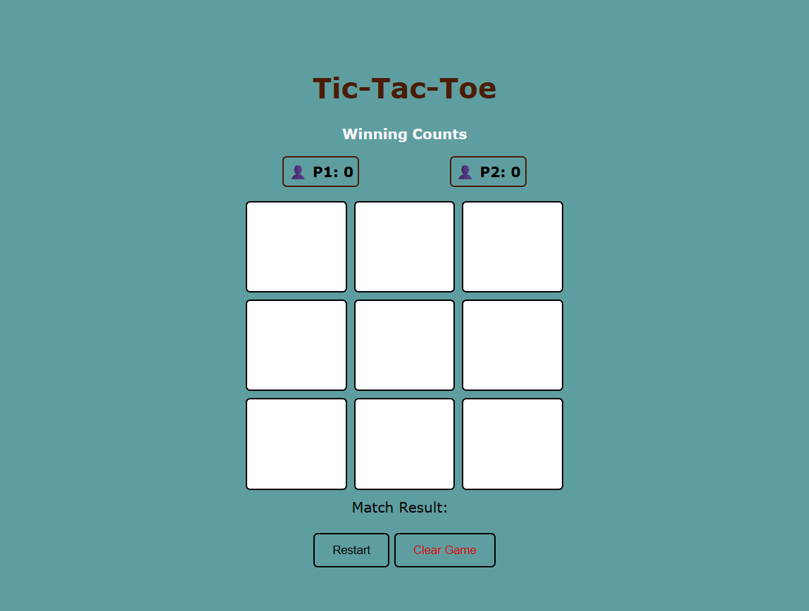

# Tic Tac Toe 🎮

A classic Tic Tac Toe game built for the web — interactive, responsive, and running smoothly on modern browsers. This project demonstrates **DOM manipulation**, **event handling**, and **state management** with **vanilla JavaScript**.



---

## Tech Stack 🛠️

- **HTML5** – semantic markup
- **CSS3** – responsive design, hover effects, transitions
- **JavaScript (ES6+)** – game logic, DOM manipulation, LocalStorage

---

## Features

- Two-player mode with alternating turns
- Real-time win/draw detection
- Dynamic messages for game progress
- Scoreboard persists across sessions
- Restart and reset functionality
- Track player turns and win counts
- Persistent scores using **LocalStorage**

---

## Installation

```bash
git clone https://github.com/your-username/tic-tac-toe.git
