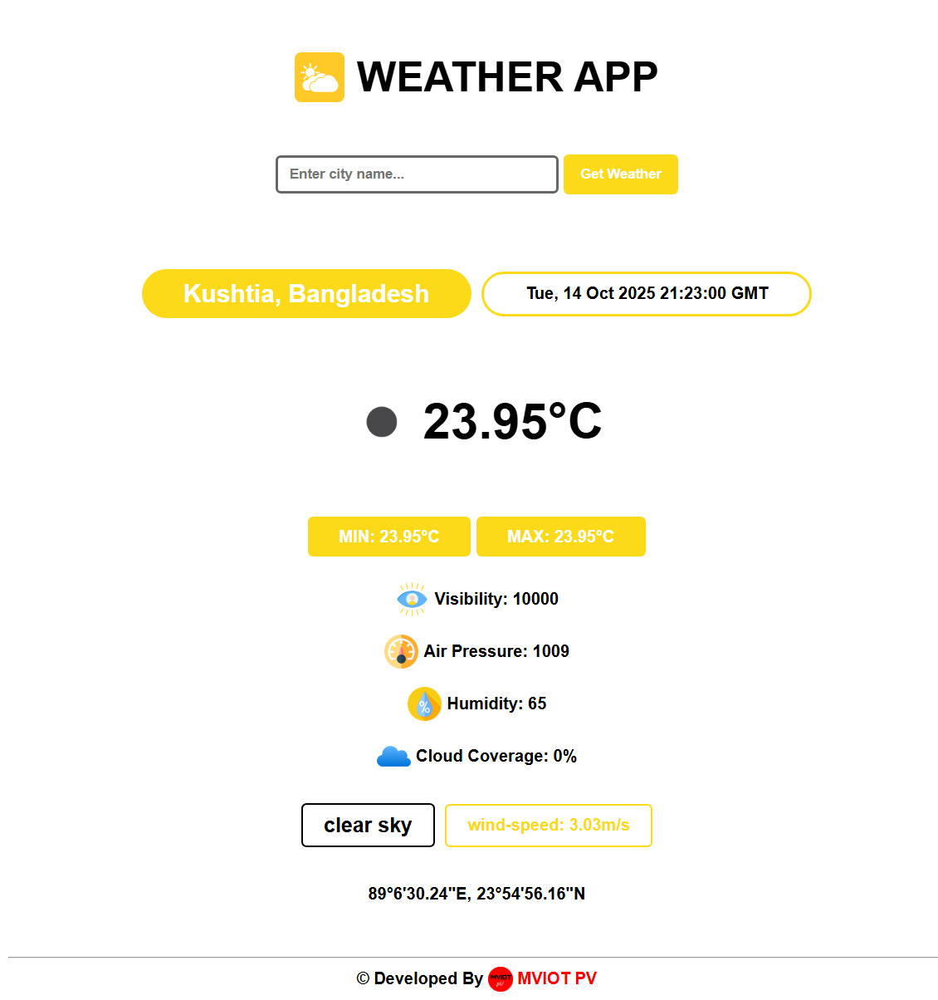

# 🌦️ Dynamic Weather App

A sleek and responsive weather application built using **HTML, CSS, and JavaScript**.  
This project automatically detects your location (with permission) and displays **real-time weather data** — including temperature, humidity, wind speed, pressure, and cloud coverage — for your current or searched city.

---

## ✨ Features

- 🌍 **Auto-detects your current location** weather on load  
- 🔍 **Search functionality** for any global city  
- 🕒 **Real-time local date & time** based on city timezone  
- 🌤️ **Dynamic weather icons** from OpenWeatherMap  
- 🌡️ Displays **temperature, humidity, air pressure, visibility, and wind speed**  
- ☁️ **Cloud coverage indicator**  
- 🧭 **Latitude and longitude** displayed in DMS (Degree-Minute-Second) format  
- ⚙️ **Fallback mechanism** if geolocation is denied (defaults to New York)

---

## 🖼️ Project Preview



---

## 🧠 How It Works

1. When the app loads:
   - It checks if **geolocation** is allowed.
   - If yes, it fetches weather data using your coordinates.  
   - If no, it falls back to **New York City** weather.

2. You can manually search for any city using the input bar.  
3. The app dynamically updates all weather parameters and icons based on the API response.  

---

## ⚙️ Tech Stack

| Technology | Purpose |
|-------------|----------|
| **HTML5** | App structure |
| **CSS3 (Media Queries)** | Responsive design |
| **JavaScript (ES6)** | Core logic and API integration |
| **OpenWeatherMap API** | Real-time weather data |
| **Geolocation API** | Get user’s current location |

---

## 🚀 Installation & Setup

Clone the repository and run the app locally in your browser.

### 🧩 1. Clone the repo

```bash
git clone https://github.com/MdMehrabHasanSompod/vanilla-projects.git
